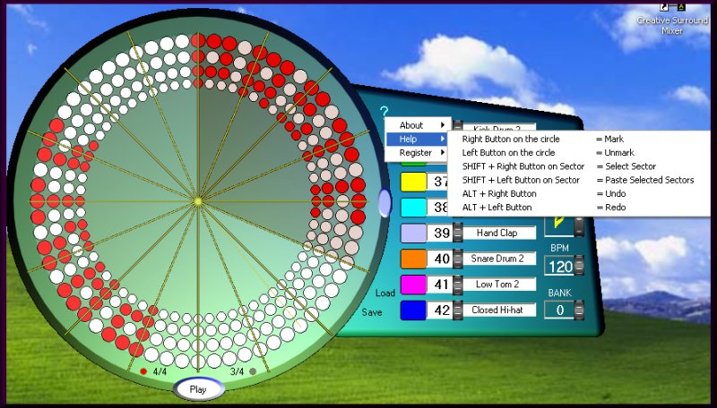



## VIRTUAL DRUM FREEWARE VERSION

### Description

This is the final version, now with selection of sectors, Paste/Undo/Redo functions and Wheel Button to chance instruments.

The INTERCOM Project (built in) enable the communication (Start/Stop/BPM) with the VIRTUAL GUITAR Software or with other project.
 
### More Info
 

             |
---                |---
**Submitted On**   |2005-10-18 19:11:58
**By**             |[Agustin Rodriguez](https://github.com/Planet-Source-Code/PSCIndex/blob/master/ByAuthor/agustin-rodriguez.md)
**Level**          |Intermediate
**User Rating**    |4.8 (76 globes from 16 users)
**Compatibility**  |VB 6\.0
**Category**       |[Complete Applications](https://github.com/Planet-Source-Code/PSCIndex/blob/master/ByCategory/complete-applications__1-27.md)
**World**          |[Visual Basic](https://github.com/Planet-Source-Code/PSCIndex/blob/master/ByWorld/visual-basic.md)
**Archive File**   |[VIRTUAL\_DR1944901112005\.zip](https://github.com/Planet-Source-Code/agustin-rodriguez-virtual-drum-freeware-version__1-63097/archive/master.zip)

